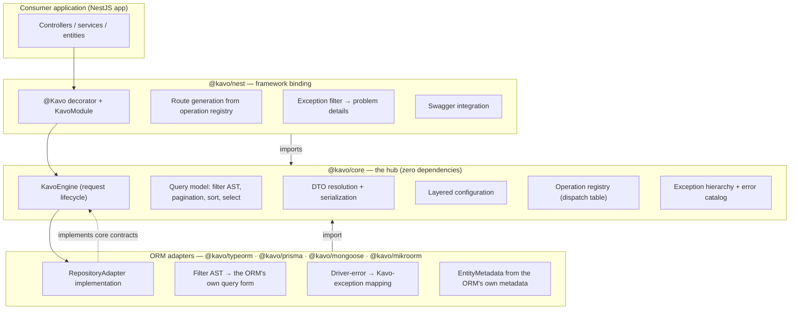
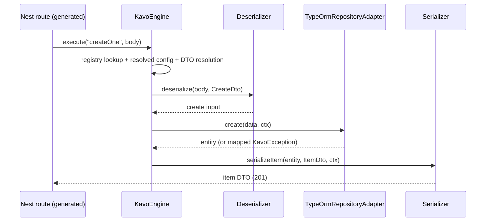
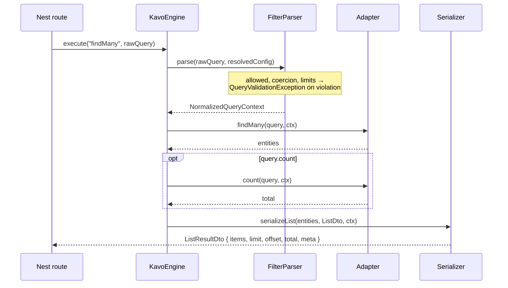
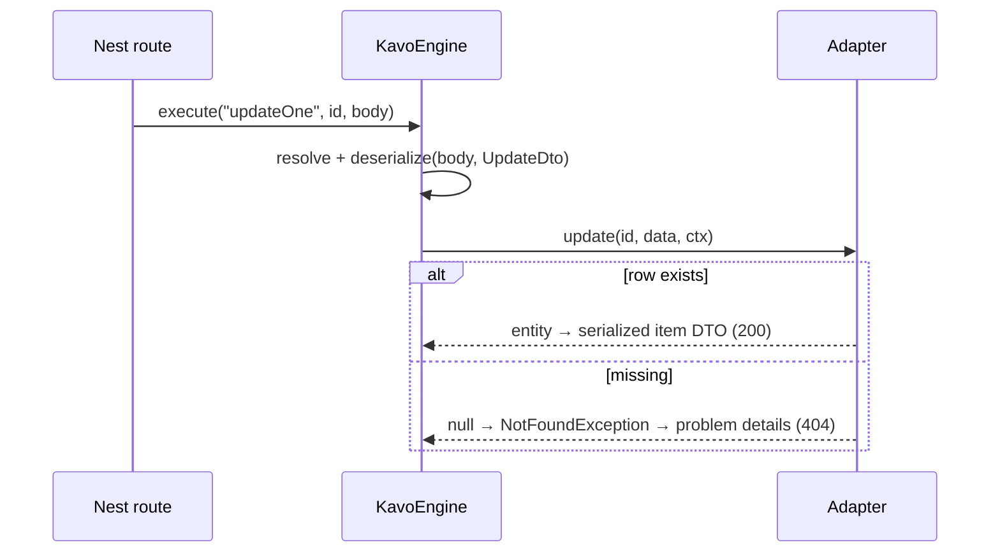
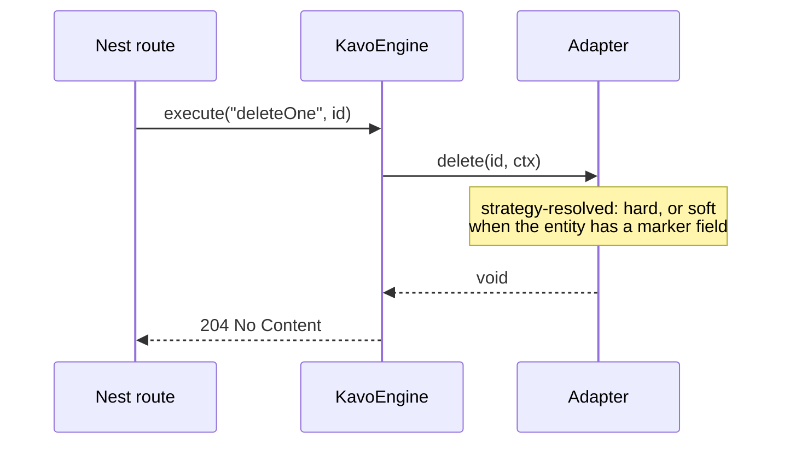

# 01 — System Architecture

Kavo lets a developer define an entity once (via TypeORM, Prisma,
Mongoose, or MikroORM) and get the full
CRUD surface — `createOne` … `purgeOne`, the `*Many` batch variants
(contracted and registered, but disabled: bulk is the optional half of
soft delete and this build dropped it) — with filtering, sorting,
pagination, nested includes, field selection, optional per-operation
DTOs, serialization, transactions, and error handling, configurable at
global, entity, operation, and per-call scope.

v6 scope is deliberately narrow: no validation subsystem, no
hooks/events, no audit trail, and no policy-evaluation _engine_ — `policy`
(ADR-0037) enforces a declared rule; it does not model roles or maintain a
policy store. The package set has grown
past the original three (`@kavo/core`, `@kavo/typeorm`, `@kavo/nest`) by
adding _edges_, never widening the hub: three further ORM adapters
(`@kavo/prisma`, `@kavo/mongoose`, `@kavo/mikroorm`) and one wire
protocol (`@kavo/graphql`), each of which cost core no change at all —
which is the clearest evidence the seams below are real.

## 1. Layers and boundaries (C4 level 2)



Every outer package depends on `@kavo/core`; core depends on nothing. An
adapter reaches the engine only through contracts it implements
(`RepositoryAdapter`), and the framework binding reaches it only through
contracts it consumes (`KavoService`, `OperationRegistry`). This is
strict dependency inversion: core owns every contract; the edges own the
technology.

## 2. Dependency graph (who may import whom)

```
@kavo/nest ──▶ @kavo/core ◀── @kavo/typeorm
     │             ▲  ▲  ▲  ▲
     │             │  │  │  └─ @kavo/prisma
     │             │  │  └──── @kavo/mongoose
     ▼ (peer)      │  └─────── @kavo/mikroorm
  @nestjs/*   @kavo/graphql
```

- `@kavo/core` imports **nothing** (ADR-0005).
- `@kavo/typeorm` imports `@kavo/core` + `typeorm` (peer). Never `@kavo/nest`.
- `@kavo/prisma` imports `@kavo/core` + `@prisma/client` (peer). Same rule.
- `@kavo/mongoose` imports `@kavo/core` + `mongoose` (peer). Same rule.
- `@kavo/mikroorm` imports `@kavo/core` + `@mikro-orm/core` (peer). Same rule.
- `@kavo/graphql` imports `@kavo/core` + `graphql` (peer) — a
  `protocols/*` package, host-framework-agnostic (ADR-0016).
- `@kavo/nest` imports `@kavo/core`, `@nestjs/*` (peers), and optionally
  `@kavo/graphql`. Never an ORM adapter — adapters enter Nest's DI
  container as providers; the binding programs against
  `RepositoryAdapter` only.
- Cross-package imports go through package barrels; deep imports are not API.

Enforced mechanically by `.dependency-cruiser.cjs` and TS project
references — an illegal import fails CI, not code review.

## 3. Package overview

| Package          | Owns                                                                                    | Must never depend on         |
| ---------------- | --------------------------------------------------------------------------------------- | ---------------------------- |
| `@kavo/core`     | Contracts, type system, engine, query model, DTO resolution, config merging, exceptions | anything (zero runtime deps) |
| `@kavo/typeorm`  | `RepositoryAdapter`/`FilterBuilder` over TypeORM; error mapping; relation loading       | NestJS, `@kavo/nest`         |
| `@kavo/prisma`   | The same contracts over a Prisma Client delegate; marker classes (ADR-0017)             | NestJS, `@kavo/nest`         |
| `@kavo/mongoose` | The same contracts over a Mongoose model; `ObjectId` conversion (ADR-0018)              | NestJS, `@kavo/nest`         |
| `@kavo/mikroorm` | The same contracts over a MikroORM `EntityManager`; per-operation forks (doc 17)        | NestJS, `@kavo/nest`         |
| `@kavo/graphql`  | `GraphQLSchema` over a `createCrud` service (ADR-0016)                                  | any ORM or framework package |
| `@kavo/nest`     | `@Kavo` decorator, module wiring, route generation, exception filter, Swagger           | any ORM adapter              |

ORM independence inside core began as a structural discipline when only
TypeORM existed; the Prisma, Mongoose, and MikroORM adapters are what
cashed it in. None required a single change to core — including Mongoose,
whose `ObjectId` primary key and join-free query language are as far from
TypeORM's model as the seam has been asked to stretch (ADR-0018).

## 4. Request lifecycle (first pass — authoritative version in doc 7)

```
Request
 → Operation Resolution     OperationRegistry lookup
 → Config Resolution        frozen ResolvedEntityConfig (bootstrap-merged)
 → Query Resolution         GET only: query → filter AST (+ IncludeTree, doc 12)
 → Policy                   resolved `policy` function, if any (ADR-0037)
 → DTO Resolution           explicit DTO, else entity-derived default
 → Deserialization
 → Repository Adapter call  transactional via the adapter-level hook ⟨reserved⟩
 → Response Mapping         result → item or ListResultDto envelope
 → Field Selection + Serialization
 → Response
```

Deliberately lean: no validation stage, no hook/event stages. Cross-cutting
behavior otherwise lives in the consumer's own controller/service code
around Kavo — the v6 tradeoff, chosen for simplicity, that a policy stage
alone crossed (ADR-0037): unlike an ad hoc hook, `policy` is one config
key resolved once at bootstrap and enforced by the registry-driven engine
for every operation, not a mechanism a consumer wires by hand per route.
Every other stage boundary is a seam with a plain default in it until the
feature behind it lands — seams, not TODOs — which is what makes the
walking skeleton shippable without stubbing later features as hacks.

## 5. Module responsibilities (inside `@kavo/core`)

| Module           | Responsibility                                                                                               |
| ---------------- | ------------------------------------------------------------------------------------------------------------ |
| `types/`         | `EntityId`, `FieldPath`, shared type utilities                                                               |
| `query/`         | Filter AST, pagination, sort, field selection, lenient + normalized query contexts, parser/builder contracts |
| `dto/`           | The six DTO slots, resolution contract, list + bulk envelopes                                                |
| `errors/`        | `KavoExceptionShape`, stable error codes, problem-details shape                                              |
| `config/`        | Settings schema, scope inputs, frozen resolved config                                                        |
| `operations/`    | Operation ids, handler contract, dispatch registry                                                           |
| `relations/`     | Relation descriptors/registry, include tree/resolver                                                         |
| `context/`       | `KavoContext` + transport-agnostic request/response envelopes                                                |
| `serialization/` | `Serializer` / `Deserializer`                                                                                |
| `persistence/`   | Reader/writer/adapter contracts, transaction manager                                                         |
| `service/`       | `KavoService`, per-call options                                                                              |

## 6. Design patterns, and why

This is the catalog of patterns the codebase uses **deliberately** — each
one names the file that implements it and the ADR that motivated it where
one exists. A pattern is listed here only if the code uses it as a
pattern; classes that merely resemble one are not in the table.

| Pattern                       | Implemented in                                                                                                                                                                                                                                                                                                            | ADR                                                                                                                       | Why over the alternative                                                                                                                                                                                                                                                                   |
| ----------------------------- | ------------------------------------------------------------------------------------------------------------------------------------------------------------------------------------------------------------------------------------------------------------------------------------------------------------------------- | ------------------------------------------------------------------------------------------------------------------------- | ------------------------------------------------------------------------------------------------------------------------------------------------------------------------------------------------------------------------------------------------------------------------------------------ |
| **Template Method**           | `KavoEngine.execute`/`run` (`core/src/engine/kavo-engine.ts`)                                                                                                                                                                                                                                                             | —                                                                                                                         | One fixed stage order with swappable stage internals beats a free-form middleware chain: ordering bugs become impossible, and the pipeline stays inspectable. Variability comes from injected collaborators, not subclass overrides — `run` is `private` and nothing extends `KavoEngine`. |
| **Strategy**                  | `PaginationStrategy` (`core/src/query/pagination-strategies.ts`), `Serializer`/`Deserializer` (`core/src/serialization/`), `ErrorHandler` (`core/src/errors/default-error-handler.ts`), `OperationHandler` (`core/src/engine/built-in-handlers.ts`), `IncludeResolver` (`core/src/relations/default-include-resolver.ts`) | —                                                                                                                         | Open/Closed: new behavior = new implementation of a core contract, never an engine edit. Each is a core-declared interface with a `Default*`/built-in implementation, injected through `KavoEngineDependencies`.                                                                           |
| **Registry (dispatch table)** | `DefaultOperationRegistry` + `createOperationRegistry` (`core/src/operations/default-operation-registry.ts`)                                                                                                                                                                                                              | [0006](../adr/0006-registry-driven-operations.md), [0007](../adr/0007-module-augmentable-operation-metadata.md)           | One mechanism, several behaviors, for built-in and overridden operations; route generation reads the same table, so features get routes for free.                                                                                                                                          |
| **Composition Root**          | `createKavo`/`createCrud` (`core/src/kavo.ts`); framework-layer roots in `nest/src/kavo.module.ts` and `typeorm/src/infrastructure.ts`                                                                                                                                                                                    | —                                                                                                                         | Every `new` in the object graph happens once at bootstrap, so resolution order is a single readable function and the result can be frozen; no service locator, and no per-request construction.                                                                                            |
| **Adapter**                   | `TypeOrmRepositoryAdapter` (`typeorm/src/typeorm-repository-adapter.ts`) against core's `RepositoryAdapter`; `KavoInfrastructure` (`metadataFor` + `adapterFor`) supplies adapter _and_ metadata as one family                                                                                                            | [0001](../adr/0001-clean-architecture-core-owns-contracts.md), [0011](../adr/0011-entity-metadata-infrastructure-seam.md) | Core states persistence in its own vocabulary and the ORM package translates, which is what lets core keep zero runtime dependencies (ADR-0005) and stay testable with an in-memory fake.                                                                                                  |
| **Specification**             | Filter AST (`core/src/query/filter.ts`)                                                                                                                                                                                                                                                                                   | —                                                                                                                         | Composable, provider-independent query trees that each adapter translates once, instead of per-ORM query fragments leaking upward. Composition only — the AST is pure data with no evaluation method; evaluation is the adapter's job (next row).                                          |
| **Interpreter**               | `FilterTranslator.toBrackets` (`typeorm/src/filter-translator.ts`)                                                                                                                                                                                                                                                        | —                                                                                                                         | The AST is walked into `QueryBuilder` calls; keeps translation local to the adapter.                                                                                                                                                                                                       |
| **Dependency Injection**      | `KavoEngineDependencies` (`core/src/engine/kavo-engine.ts`); container wiring only in `nest/src/kavo.module.ts`                                                                                                                                                                                                           | —                                                                                                                         | Core receives its collaborators; only the framework binding knows the container.                                                                                                                                                                                                           |
| **Facade**                    | `DefaultKavoService` (`core/src/service/default-kavo-service.ts`)                                                                                                                                                                                                                                                         | —                                                                                                                         | One narrow, typed entry point over engine + registry + config machinery; its methods are sugar over the same `KavoRequest` envelope the generated routes build.                                                                                                                            |

Rejected: Active Record (couples entities to persistence — kills ORM
independence), event/hook bus (removed from v6 scope; would be a second
mechanism next to the registry), per-ORM query builders in core (breaks
the one-AST discipline).

## 7. Sequence diagrams

### createOne



### findMany



### updateOne



### deleteOne



## 8. Non-goals (scope-creep insurance)

Kavo is **not**:

- an ORM — it sits on one; it never maps columns or runs migrations;
- a query language beyond the CRUD surface — no aggregations, projections
  beyond sparse fieldsets, or raw-SQL passthrough;
- a GraphQL layer;
- a validation subsystem — DTOs are shapes; teams wire NestJS's own
  `ValidationPipe` if they want validation;
- a role/permission modeling or policy-evaluation _engine_ — `policy`
  (ADR-0037) enforces a rule an application already declared, it does not
  decide what a role means, mint permissions, or maintain a Casbin/OpenFGA-
  style policy store;
- an event/hook system or audit trail.

## 9. ADR index

| ADR                                                              | Decision                                                  |
| ---------------------------------------------------------------- | --------------------------------------------------------- |
| [0001](../adr/0001-clean-architecture-core-owns-contracts.md)    | Clean architecture: core owns all contracts               |
| [0002](../adr/0002-package-topology.md)                          | Three packages under `orms/` / `frameworks/` parents      |
| [0003](../adr/0003-pnpm-plain-scripts-tsc-build.md)              | pnpm workspaces, plain scripts, `tsc -b` — no task runner |
| [0004](../adr/0004-lockstep-versioning.md)                       | Lockstep versioning                                       |
| [0005](../adr/0005-core-zero-runtime-dependencies.md)            | Zero runtime dependencies in `@kavo/core`                 |
| [0006](../adr/0006-registry-driven-operations.md)                | Registry-driven operation dispatch                        |
| [0007](../adr/0007-module-augmentable-operation-metadata.md)     | Module-augmentable `OperationMetadata`                    |
| [0008](../adr/0008-field-path-recursion-cap.md)                  | `FieldPath` recursion cap (default 3, max 5)              |
| [0009](../adr/0009-problem-details-error-shape.md)               | RFC 9457 problem details as the wire error shape          |
| [0010](../adr/0010-explicit-named-barrel.md)                     | Explicit named barrel in core                             |
| [0011](../adr/0011-entity-metadata-infrastructure-seam.md)       | Entity-metadata & infrastructure seam                     |
| [0012](../adr/0012-decoration-time-route-generation.md)          | Decoration-time route generation in `@kavo/nest`          |
| [0013](../adr/0013-config-declared-soft-delete-operations.md)    | Soft-delete operations enabled from config, not metadata  |
| [0014](../adr/0014-associate-by-id-not-deep-writes.md)           | Write-side relations: associate by id, no deep writes     |
| [0015](../adr/0015-global-operation-defaults-are-engine-only.md) | Global operation defaults are engine-only, not routing    |

## 10. Tradeoff analysis

| Choice                                          | Won                                                                                                           | Cost accepted                                                                                                                             |
| ----------------------------------------------- | ------------------------------------------------------------------------------------------------------------- | ----------------------------------------------------------------------------------------------------------------------------------------- |
| No hooks/validation stages (v6)                 | A lean, comprehensible pipeline; fewer mechanisms to learn                                                    | Cross-cutting behavior lives in consumer code; teams wanting interception must wrap the service                                           |
| A policy stage, but no policy engine (ADR-0037) | Authorization rules live in `@Kavo` config next to the operation they gate, uniformly across REST/GraphQL/MCP | Kavo still models no roles/permissions of its own; a resolved policy costs an extra read on a single-row operation                        |
| Contracts complete up front                     | Later work never mutates core types; adapters/bindings build against a stable surface                         | Some contracts (relations, bulk) ship before their implementations; risk of design-before-feedback, mitigated by shipping vertical slices |
| Registry as the single dispatch mechanism       | Disable/override/custom and route generation all fall out of one table                                        | Even built-ins pay the indirection; slightly more machinery in the minimal path                                                           |
| AST-based filtering with allowlists             | ORM independence, injection-safe by construction, 400s instead of silent drops                                | A parser/translator pair to maintain; wire grammar is a public contract                                                                   |
| Bootstrap-frozen config                         | Zero per-request merge cost; config errors fail fast with entity + key path                                   | No runtime reconfiguration; anything dynamic must be a per-call parameter                                                                 |
| `limit`/`offset` flat in the envelope           | Request/response symmetry; every consumer needs them                                                          | Envelope is less "pure" than an all-meta design; committed — it's normative                                                               |
| Explicit `{ ctx }` transaction passing          | Visible, typed, testable data flow                                                                            | More verbose than ALS ambience; ALS ships later as opt-in convenience only                                                                |
